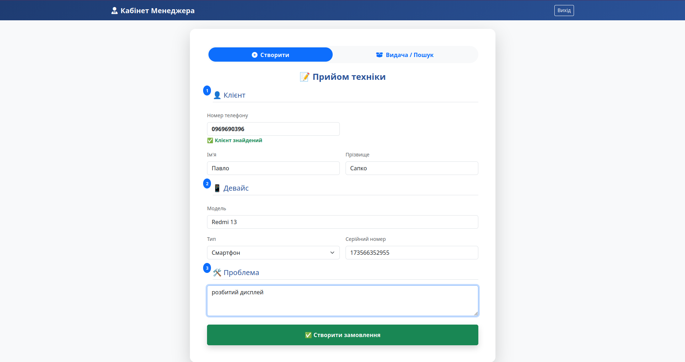
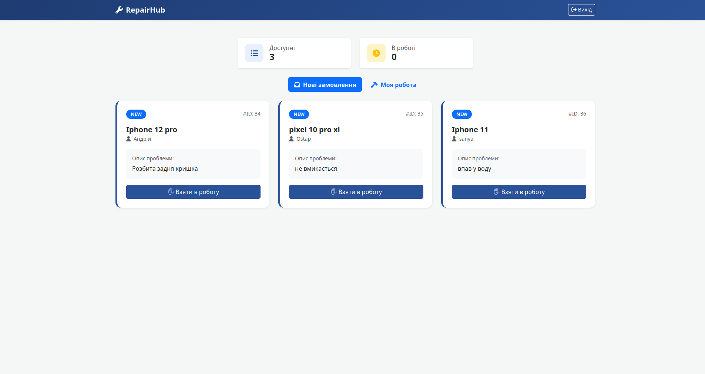
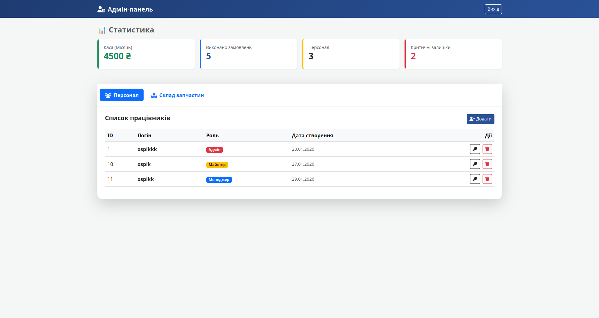

# 🛠 RepairHub CRM

<p align="center">
  
</p>
*Система автоматизації сервісного центру: від прийому пристрою до друку чека.*

## 📖 Про проект (About)

**RepairHub CRM** — це комплексне рішення для малих та середніх сервісних центрів. Проект народився як відповідь на хаос "паперового" обліку. Коли замовлення записуються на листочках, запчастини губляться на складі, а підрахунок прибутку в кінці місяця перетворюється на квест — бізнес втрачає гроші.

Ця система перетворює хаос на чіткий алгоритм:
* **Жодного втраченого клієнта:** вся історія взаємодії в одному місці.
* **Прозорий склад:** миттєвий контроль залишків запчастин.
* **Фінансова дисципліна:** автоматичний розрахунок вартості робіт та звітність.

Для мене цей проект став викликом у проектуванні складних систем з розмежуванням прав доступу та асинхронною архітектурою.

---

## 🛡 Безпека та Надійність (Security First)

Проект побудований з урахуванням сучасних стандартів безпеки даних:

* **Багаторівнева Авторизація:** Використано **OAuth2** з **JWT (JSON Web Tokens)**. Реалізована система з `access` та `refresh` токенами, що забезпечує стабільну та безпечну сесію.
* **Захист паролів:** Жодних відкритих паролів у базі. Використовується надійне хешування.
* **Закрита реєстрація:** Нового співробітника може створити **лише адміністратор**. Це виключає появу випадкових людей у системі.
* **Role-Based Access Control (RBAC):** Кожен користувач бачить лише те, що йому дозволено за роллю. Менеджер не зможе видалити працівника, а майстер не змінить ціни на складі.

---

## 🚀 Основний функціонал (Key Features)

### 👨‍💼 Модуль Менеджера (Customer Relations)
* **Швидкий прийом:** Пошук клієнта за номером телефону або створення нового в пару кліків.
* **Оформлення замовлення:** Реєстрація пристрою, опис проблеми та миттєвий запуск у роботу.
* **Видача та розрахунок:** Зручний пошук готових замовлень та **автоматична генерація чека** для клієнта.

### 🛠 Модуль Майстра (Technical Workflow)
* **Робочий стіл:** Список доступних замовлень ("Вільні") та особистий кабінет ("Мої замовлення").
* **Керування ремонтом:** Зміна статусів, додавання використаних запчастин зі складу та фіксація вартості виконаної роботи.
* **Авто-калькуляція:** Система сама рахує фінальну суму (робота майстра + ціна запчастин).

### 👑 Модуль Адміністратора (Management & Analytics)
* **HR-менеджмент:** Повний контроль над штатом (створення, редагування, звільнення співробітників).
* **Контроль складу:** Моніторинг залишків, додавання нових позицій та редагування існуючих.
* **Дашборд статистики:** Наочні показники доходу за місяць, кількість закритих замовлень та сповіщення про запчастини, що закінчуються.

---

## 🛠 Технологічний стек (Tech Stack)

**Backend:**
* **FastAPI:** Високопродуктивний фреймворк для побудови API.
* **SQLAlchemy (Async):** Робота з базою даних у неблокуючому режимі.
* **PostgreSQL:** Потужна реляційна база даних.
* **Pydantic:** Валідація даних та сувора типізація.

**Frontend:**
* **Vanilla JavaScript (ES6+):** Весь фронтенд написаний без важких фреймворків для максимальної швидкості та розуміння базових принципів Web API.
* **Bootstrap 5:** Сучасний та адаптивний UI.

**DevOps:**
* **Docker & Docker Compose:** Проект повністю контейнеризований для швидкого розгортання в будь-якому середовищі.

---

## 📸 Скріншоти (Screenshots)

| Прийом замовлення | Кабінет Майстра | Кабінет Адміна
|:---:|:---:|
|  |  | 

---

## 🐳 Швидкий запуск (Installation)

Вам не потрібно встановлювати Python чи PostgreSQL. Достатньо мати встановлений **Docker**.

1. Клонуйте репозиторій:
   ```bash
   git clone [https://github.com/ospik14/repairHub.git](https://github.com/ospik14/repairHub.git)
   cd repairHub

2. Запустіть систему:
    ```bash

    docker-compose up --build

3. Додаток буде доступний за адресою: http://localhost:8000

🔮 Roadmap (Плани на розвиток)

    [ ] Інтеграція з Telegram API для сповіщення клієнтів про готовність.

    [ ] Модуль розширеної фінансової звітності (графіки прибутку/витрат).

    [ ] Мобільний додаток для майстрів (React Native).